# Raspberry Pi Cellular Gateway

## 1.0 Project Introduction

Settle in and get ready for a ride because this tutorial covers a lot of the technical buzzwords around IoT. We’ll be making an IoT [Gateway](https://en.wikipedia.org/wiki/Gateway_(telecommunications)) with a Raspberry Pi Zero W. To achieve this we’ll put the Pi’s built-in WiFi antenna into AP Mode (Access Point), or in other words, the Pi will be broadcasting its own wifi network for devices to connect.

There will be some [NodeMCUs](http://www.nodemcu.com/index_en.html) that will connect to the Pi’s WiFi. To make communication between the nodes and Pi extremely simple we’ll use [MQTT](http://mqtt.org/). The Pi will act as the MQTT Broker (server) which the nodes will publish data.

Lastly, we’ll consume the node’s data on the Pi through MQTT Subscribe and perform some data manipulation ([edge computing](https://en.wikipedia.org/wiki/Edge_computing)). We'll then send the modified data through [Hologram's Global Cellular Network](https://hologram.io/iot-sim-card/) to the cloud using [Hologram's Nova](https://hologram.io/nova), Python SDK, and [Data Engine](https://hologram.io/data-engine).

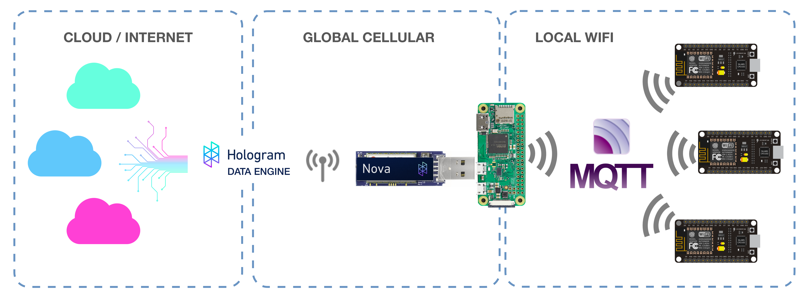

## 2.0 Setup the Raspberry Pi

I like to access my Pi through SSH over my local wifi network, but since we’ll be turning this Pi into a router, we’ll need to find another way to access the Pi. Below are a few other connection options and my thoughts:

- **Ethernet Cable:** Unfortunately the Pi Zero does not have a network jack.

- **Keyboard and Monitor:** I rarely consider this option since I prefer working in the development environment of my main computer, but if there is no other option available and you have the extra peripherals this may be chosen.

- **TTL Serial Cable:** This is a great option, and I would have picked this. Unfortunately, I did not have a USB Console cable available to me while writing this tutorial. [Adafruit sells a popular TTL Serial Cable compatible with the Pi.](https://www.adafruit.com/product/954) 

- **USB Serial Console:** There is a way to turn the single USB port on the Pi into a network interface, giving us SSH access over USB cable, SWEET!

We’ll initially access the Pi through the USB>Serial interface then later we’ll connect to the Pi’s own WiFi network.

### Enable USB Serial Console

*(modified from https://www.youtube.com/watch?v=aL1pWI2K60w)*

Install the latest [Raspbian](https://www.raspberrypi.org/downloads/raspbian/) (either Lite or Desktop will work).

Insert SD card into your main computer.

Open a terminal and change directory into the BOOT drive. On Mac OSX:

```bash
➜ cd /Volumes/boot/
```

Modify the config file:

```bash
➜ nano config.txt
```

At the bottom of the config file comment out the audio setting and add the three additional settings. `dwc2` allows ethernet over usb and the other two settings disable the onboard LED to conserve energy. 

```
# Enable audio (loads snd_bcm2835)
#dtparam=audio=on

dtoverlay=dwc2
dtparam=act_led_trigger=none
dtparam=act_led_activelow=on
```

Save the file by typing in **Control-X** then **Y** then **return**.

Modify the command line file:

```bash
➜ nano cmdline.txt
```

Add `modules-load=dwc2,g_ether` (after `rootwait` , before `quiet` ). Save the file by typing in **Control-X** then **Y** then **return**.

Lastly, enable SSH. SSH is not enabled by default. Adding an empty file named SSH will enable it during the next boot.

```bash
➜ touch ssh
```

Eject SD card and insert into the Pi. Connect the Pi micro USB port to your computer’s USB. Make sure it is the USB port on the Pi Zero and not the PWR port. The Pi should be powered through the USB port.

**OSX:**

After a minute or two - open a terminal app on your computer and SSH into the Pi (user “pi”, password “raspberry” - no quotes).

```bash
➜ ssh pi@raspberrypi.local
```

**Windows:**

On Windows we'll need to setup the RNDS driver to gain the SSH functionality.

1. Goto Device Manager and find RNDS/Ethernet Gadget under Other devices. Right-click on the device and select *update driver software*. 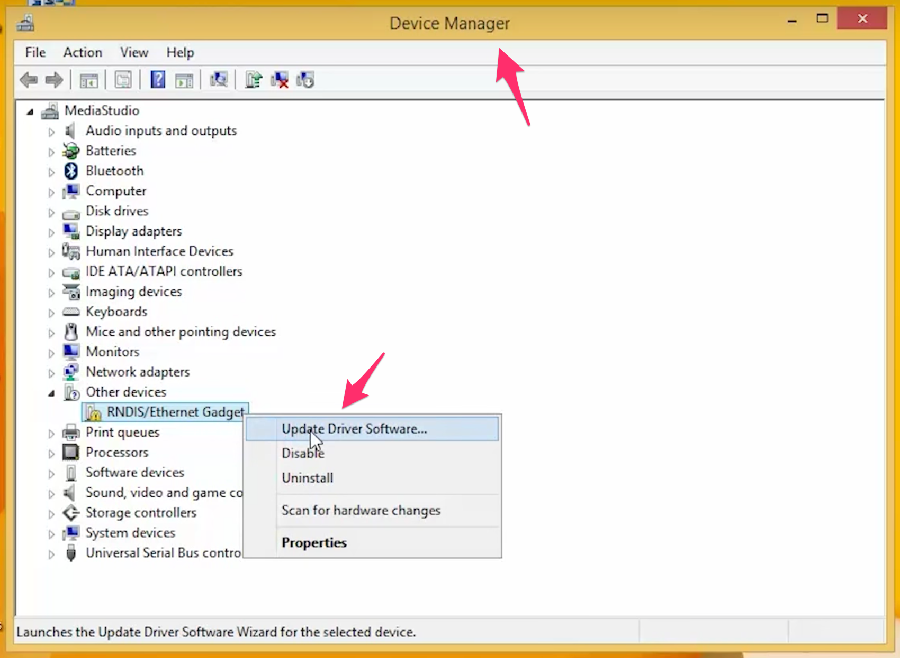
- Browse my computer 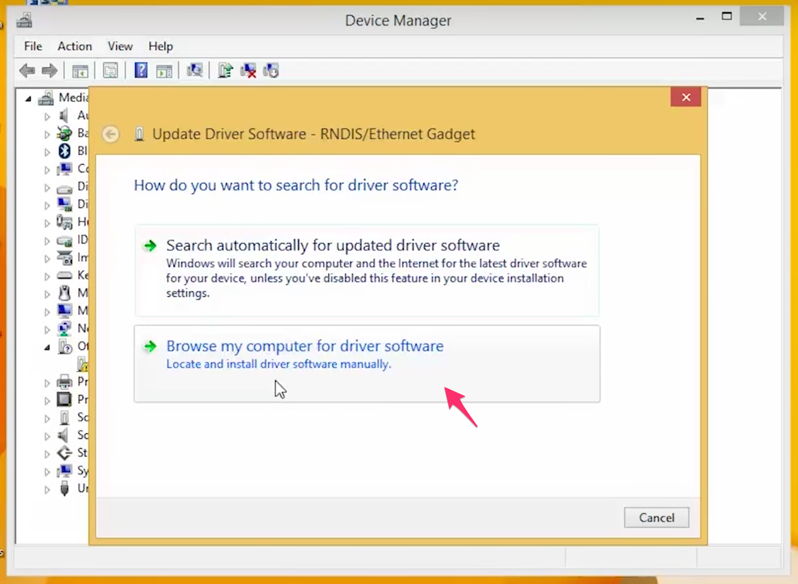
- Pick from a list of drivers 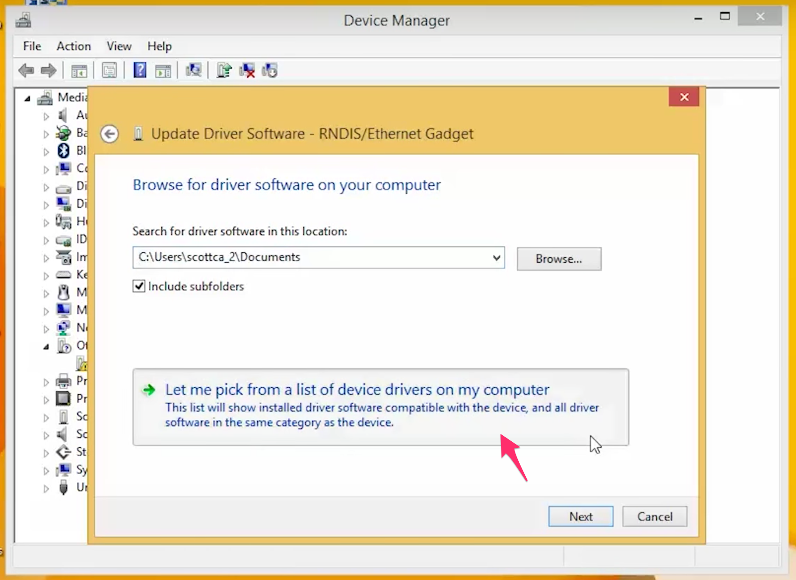
- Find Microsoft &gt; on the right select Remote NDS Compatible Device 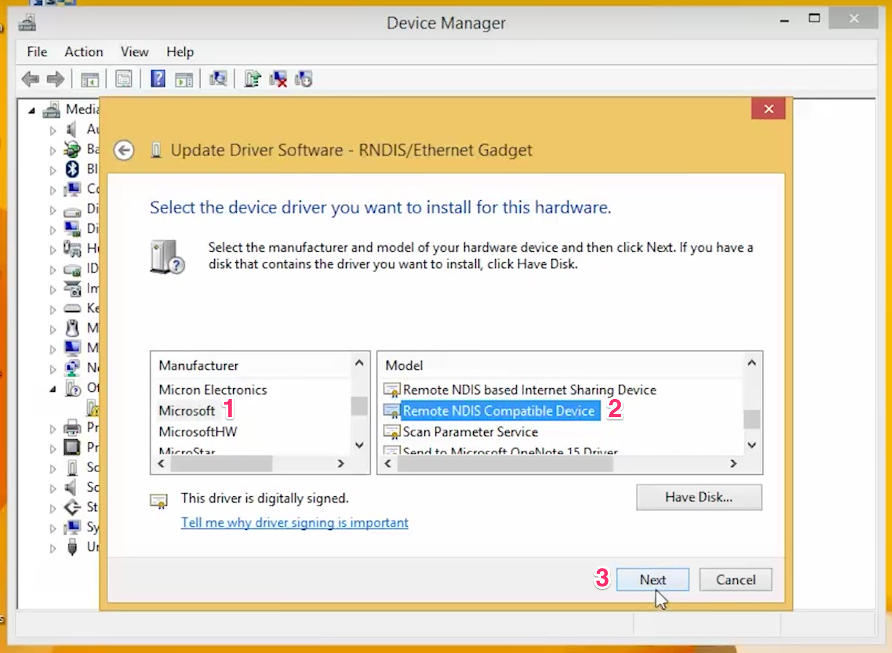
- The Pi should now show up and able to be SSH with [Putty](http://www.putty.org/) 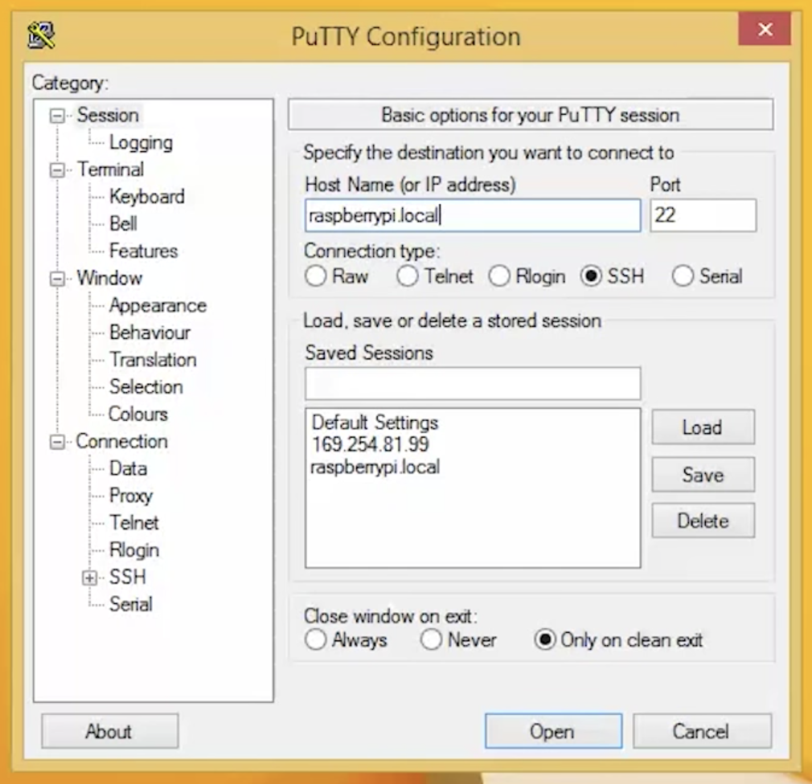

### Share Internet from Computer to Pi

Your Pi is accessible through SSH, but it still does not have access to the internet. Without the internet, we're not able to update the Pi or install any additional libraries required by this tutorial.

```bash
➜ ping www.google.com
```

You should not be able to ping the server (unless you already have internet sharing enabled).

Close the SSH session by typing `exit` before going forward.

**OSX:**

Open System Preferences, select Sharing. 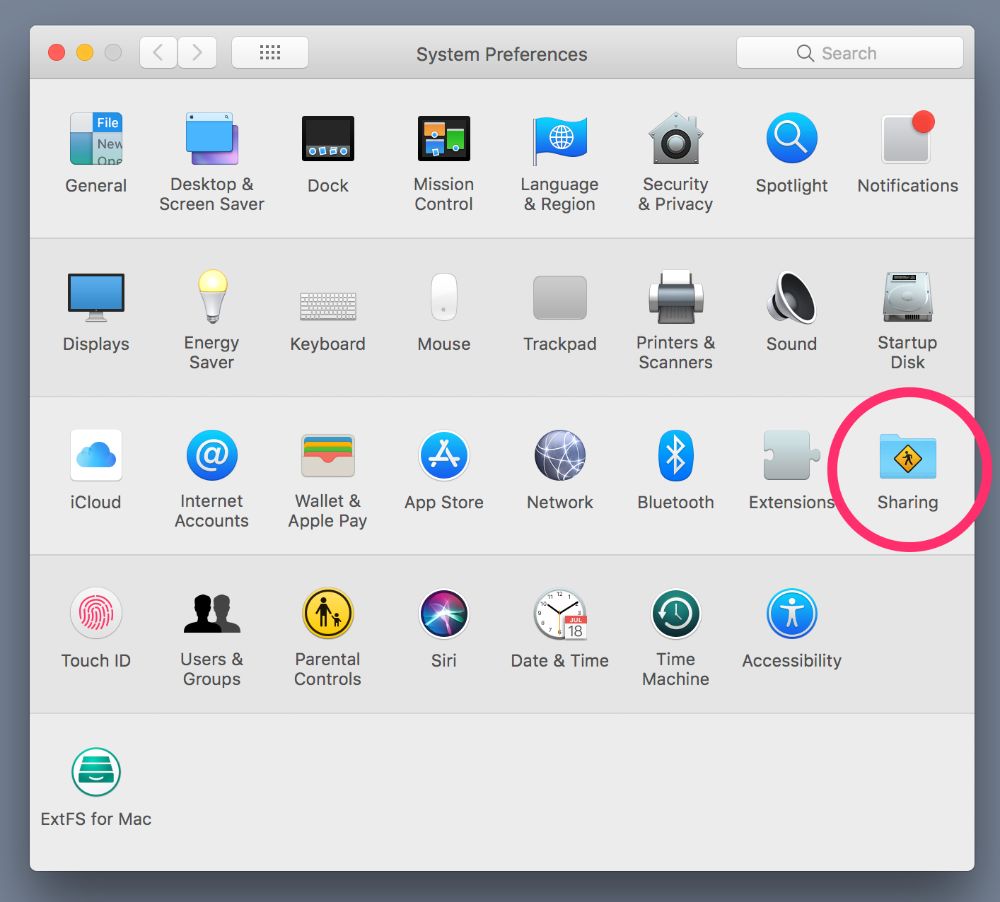

Configure RNDIS Gadget to share your WiFi connection. 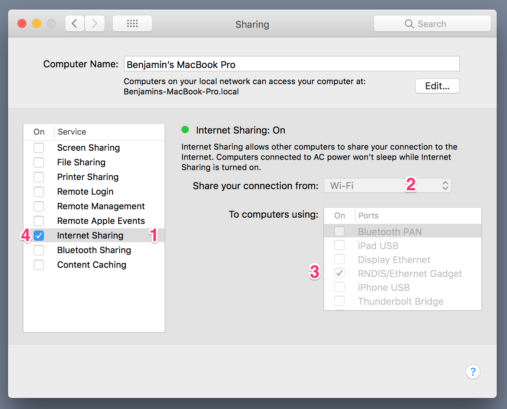

Connect through SSH and reboot the Pi

```bash
➜ ssh pi@raspberrypi.local
➜ sudo reboot
```

After reboot SSH back into the Pi. It should now have internet.

```bash
➜ ping www.google.com
```

**Windows:**

Open Network Connections, right click on the connection you want to share and select *Properties*. 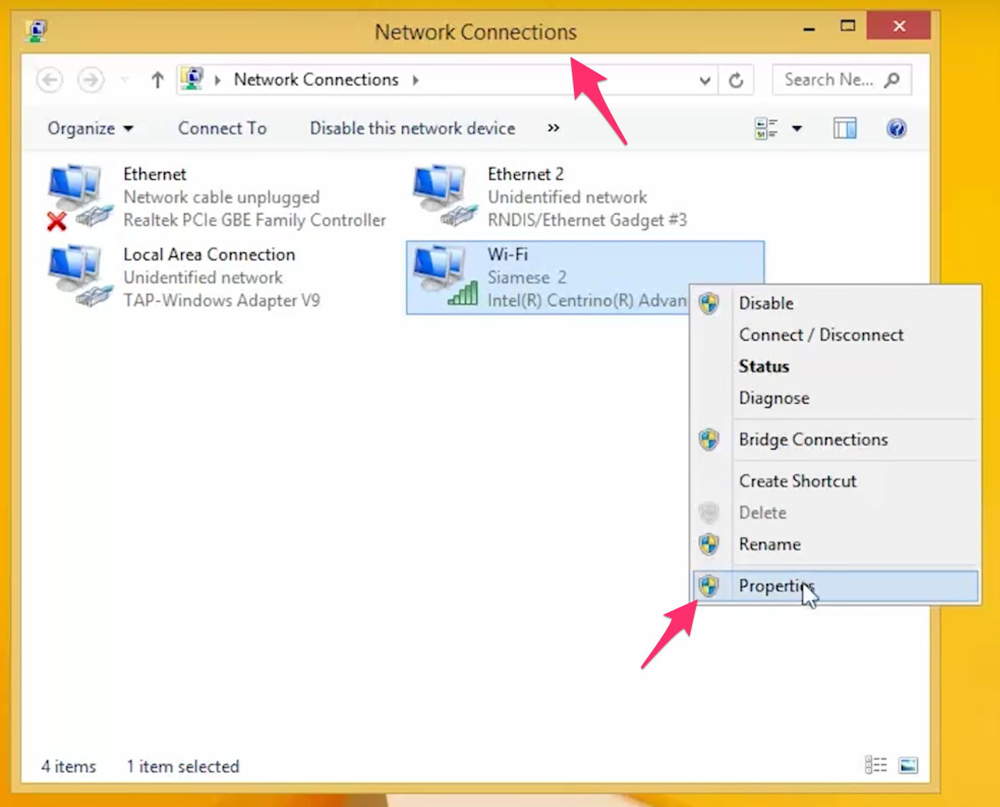

Select the Sharing tab, check Allow other network users…, from the drop-down select the connection of the Pi RNDIS Gadget. 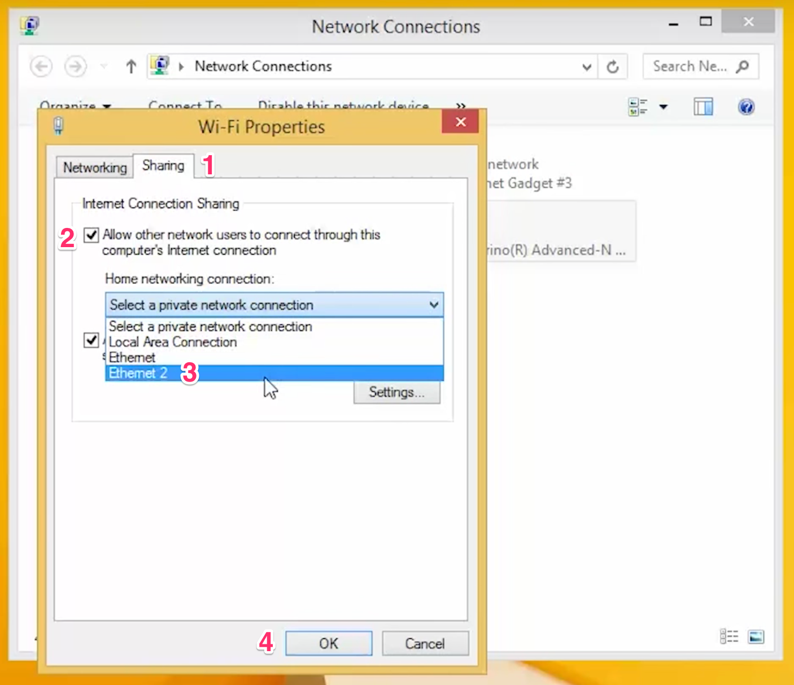

Putty into the Pi and reboot.

```bash
➜ sudo reboot
```

After reboot SSH back into the Pi. It should now have internet.

```bash
➜ ping www.google.com
```

### Configure Raspbian

Alright, we should have an SSH session going. In the terminal run the following to bring up the Raspbian Stretch configuration. These config changes will require a Pi reboot. Just start another SSH session once the Pi becomes available again.

```bash
➜ sudo raspi-config
```

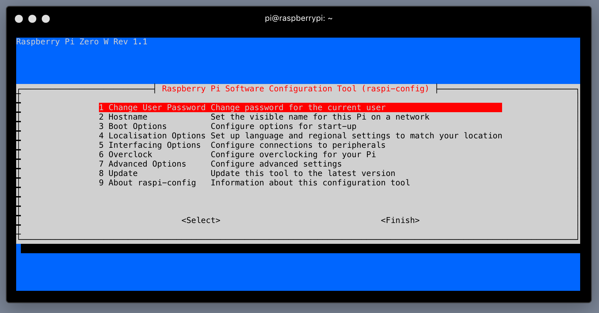

We're going to set a few options:

- 3 Boot Options > B1 Desktop/CLI > B1 Console

- 7 Advanced Options > A1 Expand Filesystem

- 5 Localisation Options > I2 Change Timezone

- 5 Localisation Options > I3 Change WiFi Country

- 8 Update

- Optional but recommended
        - 1 Change User Password
        - 2 Hostname 

**NOTE:** to conserve energy we are disabling Raspbian's UI (Pixel) and only allowing the console.

To conserve more energy we will also disable the HDMI output

```
➜  sudo nano /etc/rc.local
```

At the bottom, but before `exit 0` add this line:

```
/usr/bin/tvservice -o
```

## 3.0 Configure Pi as an Access Point

*(modified from https://learn.adafruit.com/setting-up-a-raspberry-pi-as-a-wifi-access-point)*

To work as an access point, the Raspberry Pi will need to have access point software installed, along with DHCP server software to provide connecting devices with a network address.

```bash
➜ sudo apt-get install hostapd isc-dhcp-server 
```

*Ignore any DHCP errors*

IPTables will give us the tools we need ot manage multiple connections. The `iptables-persistent` package ensures the right settings are set during startup.

```bash
➜ sudo apt-get install iptables-persistent
```

Two *config* screens will prompt you, say **Yes** to both.

**Configure DHCP**

Next, we need to setup DHCP since the Pi will be managing local IP addresses of the nodes.

```bash
➜ sudo nano /etc/dhcp/dhcpd.conf
```

Comment out these two lines

```Python
#optiondomain-name "example.org";
#optiondomain-name-serversns1.example.org, ns2.example.org;
```

Uncomment 

```Python
authoritative
```

Add these lines at the bottom of the file.

```Python
subnet 192.168.42.0 netmask 255.255.255.0 {
    range 192.168.42.10192.168.42.50;
    option broadcast-address 192.168.42.255;
    option routers 192.168.42.1;
    default-lease-time 600;
    max-lease-time 7200;
    option domain-name "local";
    option domain-name-servers 8.8.8.8, 8.8.4.4;
}
```

Save the file by typing in **Control-X** then **Y** then **return**.

```bash
➜ sudo nano /etc/default/isc-dhcp-server
```

Change the interface(s) to wlan0:

```
INTERFACESv4=“wlan0” 
INTERFACESv6=“wlan0”
```

Save the file by typing in **Control-X** then **Y** then **return**.

**Configure the Network Interface**

Bring down the local wifi in case you have it up right now.

```bash
➜ sudo ifdown wlan0
```

```bash
➜ sudo nano /etc/network/interfaces
```

Make sure your file looks like this:

```
auto lo

iface lo inet loopback
iface eth0 inet dhcp

allow-hotplug usb0
iface usb0 inet dhcp

allow-hotplug wlan0
iface wlan0 inet static
  address 192.168.42.1
  netmask 255.255.255.0
```

Save the file by typing in **Control-X** then **Y** then **return**.

Set the static IP for wifi right now:

```bash
➜ sudoifconfigwlan0 192.168.42.1
```

**Configure the Access Point**

```bash
➜ sudo nano /etc/hostapd/hostapd.conf
```

These are the settings for the WiFi we’ll be broadcasting frome the Pi. **Make sure** the file looks exactly this (you can modify the ssid and passphrase):

```
interface=wlan0
ssid=friendly-raspberry
country_code=US
hw_mode=g
channel=6
macaddr_acl=0
auth_algs=1
ignore_broadcast_ssid=0
wpa=2
wpa_passphrase=hologram  
wpa_key_mgmt=WPA-PSK
wpa_pairwise=CCMP
wpa_group_rekey=86400
ieee80211n=1
wme_enabled=1
```

Save the file by typing in **Control-X** then **Y** then **return**.

Now point the startup Daemon to use this configuration file.

```bash
➜ sudo nano /etc/default/hostapd
```

Add the file location AND make sure to remove the '#' at the beginning of this line:

```
DAEMON_CONF="/etc/hostapd/hostapd.conf"
```

And one more time.

```bash
➜ sudo nano /etc/init.d/hostapd
```

Change `DAEMON_CONF=` to:

```
DAEMON_CONF=/etc/hostapd/hostapd.conf
```

**Configure Network Address Translation (NAT)**

The NAT determines how to move data between the network interfaces and allow multiple clients to connect to the WiFi.

```bash
➜ sudo nano /etc/sysctl.conf
```

Find ` net.ipv4.ip_forward=1 ` and uncomment it. Save the file by typing in **Control-X** then **Y** then **return**.

Activate the change immediately:

```bash
➜ sudo sh -c "echo 1 > /proc/sys/net/ipv4/ip_forward"
```

Run the following commands to configure wlan0 and usb0:

```bash
➜ sudo iptables -t nat -A POSTROUTING -o usb0 -j MASQUERADE
```

```bash
➜ sudo iptables -A FORWARD -i usb0 -o wlan0 -m state --state RELATED,ESTABLISHED -j ACCEPT

```

```bash
➜ sudo iptables -A FORWARD -i wlan0 -o usb0 -j ACCEPT
```

```bash
➜ sudo sh -c "iptables-save > /etc/iptables/rules.v4"
```

Run the following two commands to verify things got set.

```bash
➜ sudo iptables -t nat -S
➜ sudo iptables -S
```

The response should look exactly like this:
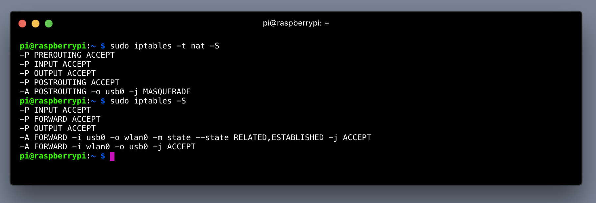

Let's reboot to allow everything to execute. Start a new SSH session after reboot.

```bash
➜ sudo reboot
```

**Finishing Touches**

Let's log back into the Pi and fire up the Access Point.

```bash
➜ sudo service hostapd start 
➜ sudo service isc-dhcp-server start
```

Now, from another device, you should see a new WiFi network and be able to log-in. If not then go back to double check your work.

Devices within the vicinity of the Pi can connect to it through WiFi.

To make the AP come up during boot run the following:

```bash
➜ sudo update-rc.d hostapd enable 
➜ sudo update-rc.d isc-dhcp-server enable
```

You can monitor activity by running:

```bash
➜ tail -f /var/log/syslog
```

## 4.0 MQTT Broker on the Pi

On the Raspberry install Mosquitto - An open-source and popular MQTT Broker. 

```bash
➜ sudo apt-get install mosquitto mosquitto-clients
➜ sudo pip install paho-mqtt
```

Initially, Mosquitto is installed with no security, meaning anyone on the network can publish and subscribe without a password. Since the Pi is running a private password protected network, we’ll be fine keeping the default MQTT settings.

Create Python script to gather all data

```bash
➜ sudo nano gateway.py
```

```python
import time
# python library for publishing and subscribing to MQTT data
import paho.mqtt.client as mqtt

# This script is running on the same machine the MQTT Broker (server)
# is running on. Localhost will work fine, otherwise use the Broker IP.
Broker = "localhost" 

# Topics are how MQTT organize data. 
# Clients publish data to a specific topic(s)
# Clients also can subscribe to a topic(s) and wild cards
# Topics and subtopics are organized in a folders-ish structure 
sub_topic = "node/value"

# when connecting to mqtt do this;
def on_connect(client, userdata, flags, rc):
    print("Connected with result code "+str(rc))
    client.subscribe(sub_topic)

# when receiving a mqtt message do this;
def on_message(client, userdata, msg):
    message = str(msg.payload)
    print(client)
    print(msg.topic+" "+message)

# Istantiate a new Client
client = mqtt.Client()
client.on_connect = on_connect
client.on_message = on_message

# Connect to the broker, by default broker runs on port 1883 
client.connect(Broker, 1883, 60)

# Paho's loop that keeps data streaming
client.loop_start()

# We create our own loop to keep this script running 
while True:
    time.sleep(3)
```

**Start Pi Script**
Start the script by running

```bash
➜ sudo python gateway.py
```

To terminate the script press **CTRL+C**

Have the script running before moving to the next step.

**Learn More about MQTT**

- [MQTT Basics](https://en.wikipedia.org/wiki/MQTT)
- [Mosquitto MQTT Broker](https://mosquitto.org/)
- [Paho MQTT client libraries](http://www.eclipse.org/paho/)


## 5.0 Node Devices

We'll be using the Arduino IDE to flash [NodeMCU](http://www.nodemcu.com/index_en.html) development boards. NodeMCU uses the affordable [Espressif ESP-8266](http://espressif.com/en/products/hardware/esp8266ex/overview) WiFi module and is capible of running Lua, MicroPython, Javascript, and C/C++. We'll use C/C++ to program these devices. 

Install an IDE to flash micro-controllers. Here are two options:
- [PlatformIO](http://platformio.org/)
- [Arduino IDE](https://www.arduino.cc/en/Main/Software)

Install the board and code library dependencies:

- [PubSubClient](https://github.com/knolleary/pubsubclient) by Nick O’Leary
    - [PlatformIO Installation](http://platformio.org/lib/show/89/PubSubClient)
    - ArduinoIDE Installation - Under drop-down *Sketch > Include Library > Manage Libraries...* then search and install for PubSubClient

- Install NodeMCU Board support
    - PlatformIO Installation - support already built in :)
    - ArduinoIDE Installation - [follow these instructions](https://github.com/esp8266/Arduino#installing-with-boards-manager)

Node device code:

```cpp
#include <ESP8266WiFi.h>
#include <PubSubClient.h>

// Pi's access point name
const char* ssid = "friendly-raspberry";

// Pi's access point password
const char* password = "hologram";

// broker IP address
const char* mqtt_server = "192.168.42.1";

WiFiClient espClient;
PubSubClient client(espClient);
long lastMsg = 0;
char msg[50];
int value = 0;

void setup_wifi() {

  delay(10);
  // We start by connecting to a WiFi network
  Serial.println();
  Serial.print("Connecting to ");
  Serial.println(ssid);

  WiFi.begin(ssid, password);

  while (WiFi.status() != WL_CONNECTED) {
    delay(500);
    Serial.print(".");
  }

  randomSeed(micros());

  Serial.println("");
  Serial.println("WiFi connected");
  Serial.println("IP address: ");
  Serial.println(WiFi.localIP());
}

void callback(char* topic, byte* payload, unsigned int length) {
  Serial.print("Message arrived [");
  Serial.print(topic);
  Serial.print("] ");
  for (int i = 0; i < length; i++) {
    Serial.print((char)payload[i]);
  }
  Serial.println();

  // Switch on the LED if an 1 was received as first character
  if ((char)payload[0] == '1') {
    digitalWrite(BUILTIN_LED, LOW);
    // Turn the LED on (Note that LOW is the voltage level
    // but actually the LED is on; this is because
    // it is acive low on the ESP-01)
  } else {
    // Turn the LED off by making the voltage HIGH
    digitalWrite(BUILTIN_LED, HIGH);
  }

}

void reconnect() {
  // Loop until we're reconnected
  while (!client.connected()) {
    Serial.print("Attempting MQTT connection...");
    // Create a random client ID
    String clientId = "ESP8266Client-";
    clientId += String(random(0xffff), HEX);
    // Attempt to connect
    if (client.connect(clientId.c_str())) {
      Serial.println("connected");
    } else {
      Serial.print("failed, rc=");
      Serial.print(client.state());
      Serial.println(" try again in 5 seconds");
      // Wait 5 seconds before retrying
      delay(5000);
    }
  }
}

void setup() {
  // Initialize the BUILTIN_LED pin as an output
  pinMode(BUILTIN_LED, OUTPUT);
  Serial.begin(115200);
  setup_wifi();
  client.setServer(mqtt_server, 1883);
  client.setCallback(callback);
}

void loop() {
  long now = millis();

  // verify device is connected to the Broker
  if (!client.connected()) {
    reconnect();
  }

  // MQTT client library loops through checking the queue
  client.loop();

  // publish a message every 2 seconds
  if (now - lastMsg > 2000) {
    lastMsg = now;
    ++value;
    snprintf (msg, 75, "hello hologram #%ld", value);
    Serial.print("Publish message: ");
    Serial.println(msg);

    // publish msg to the topic "node/value"
    client.publish("node/value", msg);
  }
}
```

*note: This example is a modified version of a [PubSubClient example](https://github.com/knolleary/pubsubclient/blob/master/examples/mqtt_esp8266/mqtt_esp8266.ino).*

Flash this code to the device(s) with the following settings:
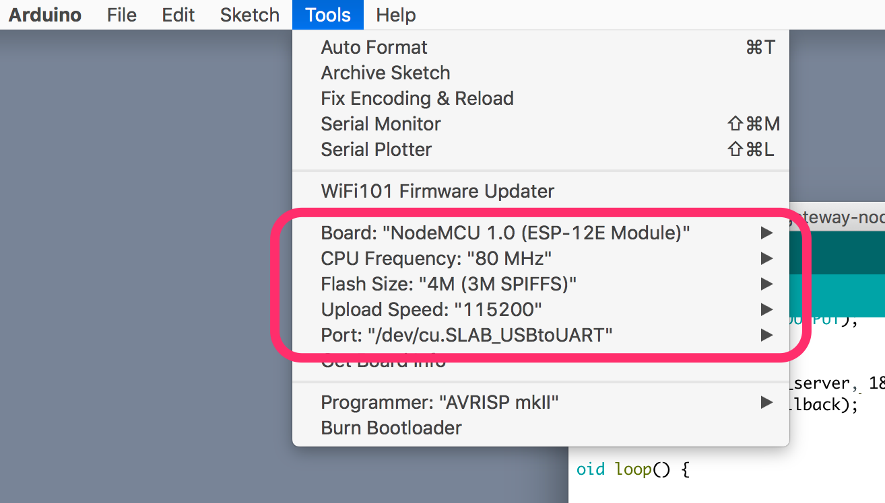

Open the serial monitor and set the baud to `115200`. You should see information about the device connecting to the wifi network, MQTT broker, and publishing data.

Over on your Pi, you should see data coming in too!

## 6.0 Add Cellular Connection

In an SSH session with your Pi (plugged into your computer’s USB) install the Hologram SDK. This may take a few minutes.

```bash
➜ curl -L hologram.io/python-install | bash
```

**Incorporate Cellular into Python Script**

Copy existing gateway script.

```bash
➜ cp gateway.py gateway-cell.py
```

Edit the newly created file.

```bash
➜ sudo nano gateway-cell.py
```

Near the top add an import for the Hologram SDK, instantiate Hologram and connect to the network.

```python
import time
import paho.mqtt.client as mqtt
from Hologram.HologramCloud import HologramCloud

hologram = HologramCloud(dict(), network='cellular')
hologram.network.connect()
```

Add a Hologram SDK `sendMessage()` to the bottom of the `on_message()` function.

```python
# when receiving a mqtt message do this;
def on_message(client, userdata, msg):
    message = str(msg.payload)
    print(client)
    print(msg.topic+" "+message)

    resp = hologram.sendMessage(message,topics=[msg.topic])
    print resp
```

Modify the loop at the very bottom to catch when the loop terminates and to disconnect from the cell network when that happens.

```
try:
    while True:
        time.sleep(5)

finally:
    hologram.network.disconnect()
```

See the `gateway_cell.py` file in the GitHub repository to check your work.

**Moar Power!**

We’re about to plug in the cellular modem (do not do it yet). Up until now, we’ve been running the Pi from USB power. Now with the modem attached we need more juice!

Find a 5.1v 2.5A power supply and connect it to the power outlet on the Pi.

Note: ensure you’re using a large enough power adaptor. [Review the Raspberry Pi Foundation's guidelines](https://www.raspberrypi.org/documentation/hardware/raspberrypi/power/README.md).*

**New SSH Connection**

Up until now, we’ve been accessing the Pi through SSH using USB. Soon we’ll need to use the USB port for the Nova. So how will we SSH into the Pi? We’ll use the Pi’s WiFi network!

Close the current SSH session by typing `exit` and disconnect the USB cable.

Now connect your development computer to the Pi’s WiFi. We’ll lose internet connectivity and for the next few moments that will be ok.

Being connected to the `friendly-raspberry` WWiFi network, you can now reconnect through SSH the same as you did before.

```bash
➜ ssh pi@raspberrypi.local
```

**Plug-in the Hologram Nova**

Time to connect the Hologram Nova. If you have not done so already, disconnect your computer from the USB port on the Pi and in its place plug in the Hologram Nova with a USB-A to USB Micro adaptor.

Now wait for the Nova to show one solid LED, and one blinking LED. This means the Nova has detected an available network. If you never get a blinking LED then disconnect the Nova and double check the SIM is inserted correctly, and the antenna is attached.

With the Nova plugged into the Pi run the new script we made above.

```bash
➜ sudo python gateway_cell.py
```

The previous Nodes should still be running and will automatically connect once the script starts running. You should be able to see serial debug messages. If you see the following, then chances are we have done everything correctly!

```
node/value hello hologram #4
0
```

P.S. While the script is running the blinking light on the Nova should become solid. This is to show we are connected to a network and have established a TCP session.

## 7.0 Conclusion

Close the SSH session by typing `exit`. This will also kill the script.

Disconnect your main computer form the Pi's WiFi and connect to your home network.

Go to the [Hologram web console](https://dashboard.hologram.io/?drawer=full) to see your data in the cloud!


**Shower Thoughts**

I feel this tutorial laid a good foundation which can be molded to fit your next gateway project. Here are a few suggestions for moving forward:

- Set your python script to automatically run after the Pi boots. You can learn the different ways to accomplish that from [this great blog post](https://www.dexterindustries.com/howto/run-a-program-on-your-raspberry-pi-at-startup/).

- You can add as many Nodes as you’d like, whenever you’d like. With MQTT you can start a new Node, and it will automatically work with the script running on the Pi. Although, you should consider publishing data that identifies the device or publish to a subtopic, one for each device with the Pi subscribing to a topic wildcard.

- The cellular `sendMessage()` function really should not be called inside the `on_message()` function. Rather, you should compute and condense the data and send to the cloud less frequently.

Enjoy!
